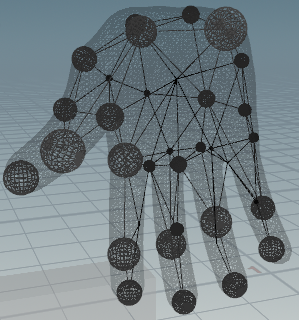

### Sphere-Meshes

Implementation following Sphere-Meshes (Jean-Marc Thiery, Emilie Guy and Tamy Boubekeur, ACM SIGGRAPH Asia 2013).


### build 

Copy the header-only libaries libigl and Eigen to extern folder. 

```bash
cmake -B build .
cmake --build build --config Release --target SphereMeshes
```

### Results

Hand mesh reduced to 35 sphere nodes:


